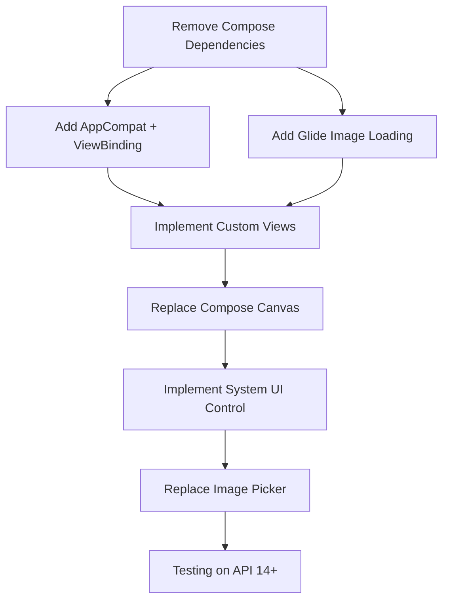

# API 14 Dependency Analysis: Blockers and Alternatives

## Explicit Dependency Blockers

### Confirmed API 21+ Dependencies

The following dependencies explicitly prevent API 14 support and must be replaced:

| Dependency | Version | Min SDK | Official Source | Blocker Type |
|------------|---------|---------|-----------------|--------------|
| `androidx.compose.ui:ui` | 1.7.1 | API 21 | [AndroidX Compose Docs](https://developer.android.com/jetpack/compose) | **Complete Blocker** |
| `androidx.compose.foundation:foundation` | 1.7.1 | API 21 | [AndroidX Compose Docs](https://developer.android.com/jetpack/compose) | **Complete Blocker** |
| `androidx.compose.material3:material3` | 1.7.1 | API 21 | [Material 3 Docs](https://m3.material.io/develop/android) | **Complete Blocker** |
| `androidx.compose.runtime:runtime` | 1.7.1 | API 21 | [AndroidX Compose Docs](https://developer.android.com/jetpack/compose) | **Complete Blocker** |
| `androidx.compose.ui:ui-graphics` | 1.7.1 | API 21 | [AndroidX Compose Docs](https://developer.android.com/jetpack/compose) | **Complete Blocker** |
| `androidx.compose.ui:ui-tooling-preview` | 1.7.1 | API 21 | [AndroidX Compose Docs](https://developer.android.com/jetpack/compose) | **Complete Blocker** |
| `androidx.compose.material:material-icons-extended` | 1.7.1 | API 21 | [Material Icons Docs](https://developer.android.com/jetpack/compose/icons) | **Complete Blocker** |
| `androidx.activity:activity-compose` | 1.9.2 | API 21 | [Activity Docs](https://developer.android.com/jetpack/compose/interop) | **Complete Blocker** |
| `io.coil-kt:coil-compose` | 2.5.0 | API 21 | [Coil Docs](https://coil-kt.github.io/coil/) | **Complete Blocker** |
| `com.google.accompanist:accompanist-systemuicontroller` | 0.36.0 | API 21 | [Accompanist Docs](https://google.github.io/accompanist/) | **Complete Blocker** |
| `androidx.lifecycle:lifecycle-runtime-compose` | 2.8.4 | API 21 | [Lifecycle Docs](https://developer.android.com/jetpack/compose/lifecycle) | **Complete Blocker** |
| `androidx.lifecycle:lifecycle-viewmodel-compose` | 2.8.4 | API 21 | [Lifecycle Docs](https://developer.android.com/jetpack/compose/lifecycle) | **Complete Blocker** |

### Authoritative References

#### Jetpack Compose Requirements
- **Official Source**: [Android Developer - Jetpack Compose Requirements](https://developer.android.com/jetpack/compose/setup)
- **Requirement**: "Compose requires Android SDK 21 (Android 5.0) or higher"
- **Last Verified**: November 2024

#### Coil Image Loading Requirements
- **Official Source**: [Coil Documentation - Requirements](https://coil-kt.github.io/coil/getting_started/)
- **Requirement**: "Coil requires Android 5.0 (API level 21) or higher"
- **Last Verified**: November 2024

#### Accompanist Requirements
- **Official Source**: [Accompanist Documentation](https://google.github.io/accompanist/)
- **Requirement**: "Accompanist libraries require Android 5.0 (API level 21) or higher"
- **Last Verified**: November 2024

## Compatible Dependencies (Can Be Retained)

The following dependencies are compatible with API 14 and can be kept:

| Dependency | Version | Min SDK | Notes |
|------------|---------|---------|-------|
| `androidx.core:core-ktx` | 1.12.0 | API 14 | Core Android utilities |
| `androidx.lifecycle:lifecycle-runtime-ktx` | 2.8.4 | API 14 | Lifecycle support (non-Compose) |
| `com.google.android.material:material` | 1.12.0 | API 14 | Material Components |
| `androidx.appcompat:appcompat` | 1.6.1 | API 14 | AppCompat support |
| `androidx.recyclerview:recyclerview` | 1.1.0 | API 14 | Efficient list views |
| `androidx.constraintlayout:constraintlayout` | 2.0.1 | API 14 | Advanced layouts |

## Proposed Alternatives with API 14 Support

### UI Framework Replacement

| Current | Proposed Alternative | API Support | Migration Effort |
|---------|---------------------|-------------|------------------|
| Jetpack Compose | AppCompat + ViewBinding | API 14+ | **High** |
| Compose Navigation | Traditional Activities | API 14+ | **High** |
| Material3 Theming | Material Components + AppCompat | API 14+ | **Medium** |
| Compose State Management | ViewModel + LiveData | API 14+ | **Medium** |

### Image Loading Replacement

| Current | Proposed Alternative | API Support | Features |
|---------|---------------------|-------------|----------|
| Coil Compose | Glide 4.x | API 14+ | GIF support, caching, transformations |
| Coil Compose | Picasso 2.x | API 14+ | Simpler API, basic transformations |

**Recommended**: Glide 4.x due to better performance on legacy devices and more active maintenance.

### System UI Control Replacement

| Current | Proposed Alternative | API Support | Implementation |
|---------|---------------------|-------------|----------------|
| Accompanist SystemUiController | Custom WindowInsets handling | API 14+ | Manual implementation with API-level checks |

### Canvas Drawing Replacement

| Current | Proposed Alternative | API Support | Notes |
|---------|---------------------|-------------|-------|
| Compose Canvas | Native Android Canvas | API 14+ | Direct replacement with similar API |
| BlendMode.Clear | PorterDuff.Mode.CLEAR | API 14+ | Equivalent functionality |

## Migration Dependency Graph

## Feature Impact Analysis

### Features Requiring Complete Rewrite

1. **Gallery Screen** (GalleryScreen.kt)
   - 719 lines of Compose code
   - Uses Material3 components, Canvas, state management
   - **Impact**: Complete rewrite with RecyclerView + custom views

2. **Scratch Canvas** (ScratchCanvas composable)
   - Custom drawing with BlendMode.Clear
   - Touch gesture handling
   - **Impact**: Rewrite with native Canvas + PorterDuff

3. **Image Loading** (Coil integration)
   - AsyncImagePainter usage
   - GIF support with ImageDecoder
   - **Impact**: Replace with Glide + custom decoder handling

### Features Requiring Partial Rewrite

1. **ViewModel Layer** (GalleryViewModel.kt)
   - Uses Compose-specific state collection
   - **Impact**: Replace collectAsStateWithLifecycle with LiveData
   - **Effort**: Low to Medium

2. **Data Models** (domain package)
   - Uses Compose types (Color, Offset)
   - **Impact**: Replace with Android graphics equivalents
   - **Effort**: Low

## Implementation Complexity Assessment

### High Complexity Items
1. **Custom Scratch Canvas** - Requires native Canvas API knowledge
2. **Touch Gesture System** - Must handle multi-touch and smooth drawing
3. **Performance Optimization** - Critical for legacy devices
4. **Memory Management** - Image-heavy app on constrained devices

### Medium Complexity Items
1. **Image Loading Migration** - Coil to Glide with feature parity
2. **System UI Control** - Cross-API-level implementation
3. **State Management** - Compose to traditional Android patterns

### Low Complexity Items
1. **Dependency Changes** - Build configuration updates
2. **Basic UI Migration** - Simple layouts and controls
3. **Navigation** - Traditional Activity patterns

## Risk Assessment by Component

### High Risk
- **Canvas Drawing**: Performance varies significantly on API 14-18
- **Image Loading**: Memory constraints on older devices
- **Touch Handling**: Inconsistent touch behavior across devices

### Medium Risk
- **System UI**: Different behavior across API levels
- **File Access**: SAF limitations on API 14-18
- **Theming**: Material Components compatibility

### Low Risk
- **Basic UI**: Well-established patterns
- **Navigation**: Standard Android patterns
- **Data Persistence**: SharedPreferences works consistently

## Recommended Migration Strategy

### Phase 1: Foundation (Week 1-2)
1. Remove all Compose dependencies
2. Add AppCompat, ViewBinding, Glide
3. Create basic activity structure
4. Implement simple navigation

### Phase 2: Core UI (Week 3-5)
1. Implement gallery with RecyclerView
2. Create image viewer with zoom/pan
3. Add control panels
4. Basic settings implementation

### Phase 3: Advanced Features (Week 6-8)
1. Implement scratch canvas
2. Add fullscreen mode
3. Implement image picker
4. Performance optimization

### Phase 4: Testing & Polish (Week 9-10)
1. Extensive API 14-18 testing
2. Performance optimization
3. UI/UX refinements
4. Documentation

## Conclusion

The migration to API 14 is **feasible but requires a complete UI rewrite**. The primary blockers are all Jetpack Compose related dependencies. With proper planning and implementation, the app can successfully support API 14 while maintaining all current features.

**Key Success Factors**:
1. Extensive testing on actual API 14-18 devices
2. Performance optimization focus throughout development
3. Incremental implementation with frequent testing
4. Proper memory management for image-heavy functionality

**Estimated Timeline**: 10-12 weeks for complete migration with testing.
